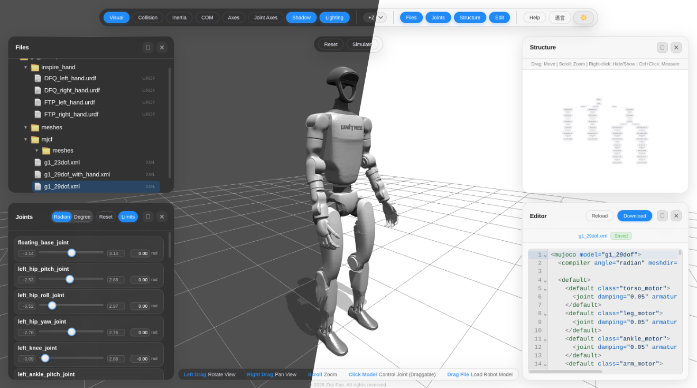

---

[中文README](./README_ZH.md)

---

# Attic Viewer

[](https://github.com/Atticlmr/attic_viewer)
[](LICENSE)
[](https://github.com/Atticlmr/attic_viewer)
[](https://github.com/Atticlmr/attic_viewer)
[](https://threejs.org/)
[](https://vitejs.dev/)
[](http://viewer.osaerialrobot.top/)

**Attic Viewer** is a web-based 3D viewer for robot models and scenes. Built on top of [Three.js](https://threejs.org/), it provides an intuitive interface for visualizing, editing, and simulating robots directly in the browser without any installation required.

**Live Demo**: http://viewer.osaerialrobot.top/

> 📝 This is a fork of [fan-ziqi/robot_viewer](https://github.com/fan-ziqi/robot_viewer), rewritten in **TypeScript**.

> pre-release: https://atticlmr.github.io/attic_viewer/ support URDF2MJCF and MJCF2URDF, but need more feedback!
## Key Features

- **Format Support**: URDF, Xacro, MJCF, USD
- **Visualization**: Visual/collision geometry, inertia tensors, center of mass, coordinate frames
- **Interactive Controls**: Drag joints in real-time
- **Measurement Tools**: Measure distances between joints and links
- **Code Editor**: Built-in CodeMirror editor with syntax highlighting
- **Integrated Conversion Workflow**: Convert between URDF and MJCF directly from the viewer
- **Export Packages**: Export converted models as ZIP packages with bundled assets and `mesh/` directory layout
- **Physics Simulation**: Integrated MuJoCo runtime for MJCF models
- **Web Deployment**: GitHub Pages workflow for automatic build and deployment on `main`

## What's New in v1.3.3

- Prevented stale asynchronous model loads from replacing the latest selected file
- Consolidated rendering into one animation loop and restored on-demand WebGL rendering
- Added explicit Three.js and MuJoCo resource disposal when models are replaced
- Added cross-origin isolation fallback for USD WASM on static hosting
- Hardened USD iframe messaging and aligned Three.js runtime/type versions
- Added regression tests plus typecheck/test gates to deployment and release workflows

## Next Release: v1.4.0

The next release will migrate MuJoCo WebAssembly from the legacy `mujoco-js` package name to the canonical Google DeepMind package, `@mujoco/mujoco`. The migration will include standalone WASM asset loading and full MJCF simulation regression coverage.

## Getting Started

```bash
# Clone the repository
git clone https://github.com/Atticlmr/attic_viewer.git
cd attic_viewer

# Install dependencies
pnpm install

# Start development server
pnpm run dev

# Build for production
pnpm run build

# Run tests
pnpm test

# TypeScript type checking
pnpm typecheck
pnpm check
```

## Development Commands

| Command | Description |
|---------|-------------|
| `pnpm dev` | Start development server |
| `pnpm build` | Build for production |
| `pnpm preview` | Preview production build |
| `pnpm test` | Run unit tests |
| `pnpm test:watch` | Run tests in watch mode |
| `pnpm test:coverage` | Run tests with coverage |
| `pnpm typecheck` | TypeScript type checking |
| `pnpm check` | Run type checking, tests, and production build |

## Project Structure

```
attic_viewer/
├── src/
│   ├── main.ts              # Application entry point
│   ├── app/
│   │   ├── App.ts           # Main application class
│   │   ├── AppState.ts      # Application state management
│   │   └── handlers/         # Event handlers
│   ├── adapters/             # Model format adapters (URDF, MJCF, USD, Xacro)
│   ├── controllers/          # Controllers (File, CodeEditor, Measurement)
│   ├── editor/              # Code editor (CodeMirror)
│   ├── loaders/             # Model loaders
│   ├── models/
│   │   └── UnifiedRobotModel.ts  # Unified robot model data interface
│   ├── renderer/            # Render managers (Scene, Visual, MuJoCo, etc.)
│   ├── ui/                  # UI components
│   ├── utils/               # Utilities
│   ├── views/               # View components (FileTree, ModelGraph)
│   └── test/                # Test setup
├── tsconfig.json            # TypeScript configuration
├── vitest.config.js         # Vitest configuration
└── vite.config.js           # Vite configuration
```

## TypeScript Migration

This project has been migrated from JavaScript to TypeScript:

- **Status**: TypeScript migration baseline completed for the current codebase
- **Build**: Passing ✓
- **Type Check**: Passing ✓
- **Tests**: Passing (30 tests) ✓

## Branches

- `main` - Stable release branch (from original repo)
- `dev` - Development branch with TypeScript rewrite

## Contributing

We welcome contributions! Please read our contributing guidelines before submitting PRs.

## License

Apache License 2.0 - see [LICENSE](LICENSE) file.
